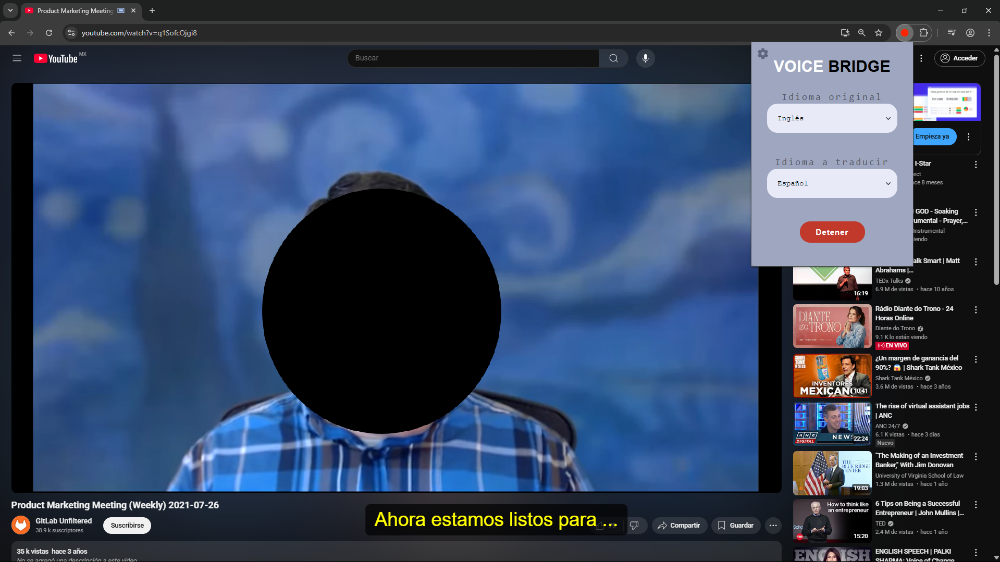
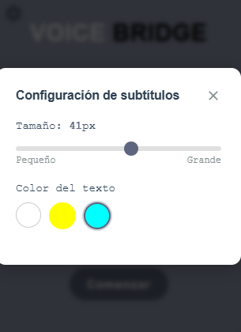

# **VOICE BRIDGE**

# Ingeniería de Software para Sistemas Inteligentes

Escuela Superior de Cómputo | Proyecto Final | 6BM1 | Ingeniería en Inteligencia Artificial

## Autores

- Cazares Leyva Bryan Jhoan
- López López Rebeca
- Pérez Nuñez Miguel Alejandro 


## Descripción del proyecto

**Voice Bridge** es una extensión para navegador que permite la traducción en tiempo real del audio en videollamadas, generando subtítulos en la pantalla...…….

## Instalación y ejecución

### 1. Clonar el repositorio

Para ejecutar el proyecto, primero es necesario clonar el repositorio usando Git:

```bash
  git clone https://github.com/MrBryan12/voice-bridge.git
```

### 2. Estructura del proyecto

Después de clonar el repositorio, verás una carpeta principal que contiene otras dos carpetas:

```bash
voice-bridge/
│
├── Extension/       # Carpeta con los archivos de la extensión del navegador
│   ├── css/          # Carpeta con los archivos CSS
│   ├── icons/        # Carpeta con los iconos de la extensión
│   ├── content.js    # Script para la manipulación del contenido de la página
│   ├── encoder.js    # Script para la codificación de datos
│   ├── manifest.json # Archivo de configuración de la extensión
│   ├── offscreen.html # Página HTML para la extensión sin interfaz
│   ├── offscreen.js  # Script asociado a offscreen.html
│   ├── popup.html    # Página HTML para el popup de la extensión
│   ├── popup.js      # Script asociado al popup
│   └── service-worker.js # Script para el servicio de fondo de la extensión
│
├── API/              # Carpeta con el backend de la API
│   └── app.py        # Script principal que maneja la API
│
└── README.md         # Archivo con la documentación del proyecto
```

### 3. Cargar la extensión en el navegador

1. Abre **Google Chrome** (o un navegador basado en Chromium como **Edge** o **Brave**).
2. Accede a `chrome://extensions/`.
3. Activa el **modo desarrollador** (esquina superior derecha).
4. Haz clic en **“Cargar extensión sin empaquetar”**.
5. Selecciona la carpeta `Extension/` dentro del repositorio clonado.
6. Se agregara el icono de la extensión en el apartado de extensiones.


### 4. Ejecutar el sistema

1. Asegurate de tener Python instalado (versión 3.8 o superior).
2. Navega a la carpeta 
```bash
   cd voice-bridge/API
```
3. Una vez dentro de esta carpeta, ejecutar el siguiente comando que instalará todas las dependencias necesarias para ejecutar el proyecto:
```bash
   pip install -r requirements.txt
```

4. Finalmente, ejecuta la API del proyecto con el siguiente comando:

```bash
   python app.py
```

Esto iniciará el servidor local que se encarga de manejar la transcripción y traducción del audio.


## Uso de la extensión Voice Bridge

Una vez que la API esté corriendo correctamente, ya puedes comenzar a usar la extensión en una videollamada o video en reproducción, para ello, sigue estos pasos:

1. Abre una **videollamada** (por ejemplo, en Google Meet, Zoom Web o cualquier otra plataforma basada en navegador) o un **video con diálogo en inglés o español**.
2. Haz clic en el **ícono de Voice Bridge** ubicado en la barra de extensiones de tu navegador (parte superior derecha).
3. Se abrirá una interfaz flotante justo debajo del icono. Esta interfaz no ocupa toda la pantalla, lo que permite seguir viendo el contenido de la videollamada o video sin interrupciones.

)

4. En la interfaz verás lo siguiente:
   - El **logotipo de Voice Bridge**.
   - Dos botones desplegables:
     - **Idioma original** (opciones: Español / Inglés)
     - **Idioma destino** (opciones: Español / Inglés)
   - Un botón **“Comenzar”**.

5. Una vez configurados los idiomas, haz clic en **“Comenzar”**. En el centro de la pantalla aparecerá un mensaje indicando que el sistema ha comenzado a operar:

```
Traducción iniciada
```

A partir de este punto, los subtítulos traducidos comenzarán a aparecer en tiempo real conforme se detecta y procesa el audio.



---

### Configuración de subtítulos

En la esquina superior izquierda de la interfaz de la extensión encontrarás un **ícono de engranaje ⚙️**, que permite acceder a la pantalla de configuración de subtítulos.



Esta sección incluye:

- Una **barra deslizadora** para ajustar el tamaño de letra (por ejemplo: 50px).
  - Desliza hacia la izquierda para reducir el tamaño.
  - Desliza hacia la derecha para aumentarlo.
- Una opción para seleccionar el **color del texto**, con tres colores disponibles:
  - Blanco
  - Amarillo
  - Azul

Estas opciones permiten personalizar la visualización de los subtítulos según las preferencias del usuario o la visibilidad sobre el fondo del video.

---

¡Con esto ya estarás listo para usar Voice Bridge en tus videollamadas o videos con traducción en tiempo real!

### Requisitos

- Python 3.8+
- Navegador basado en Chromium
- Conexión a internet
- Acceso al micrófono


### Archivos importantes

- `main.py`: Captura y traduce el audio (Python)
- `manifest.json`: Configuración de la extensión
- `popup.html`, `background.js`, etc.: Funcionalidad de la extensión
 
